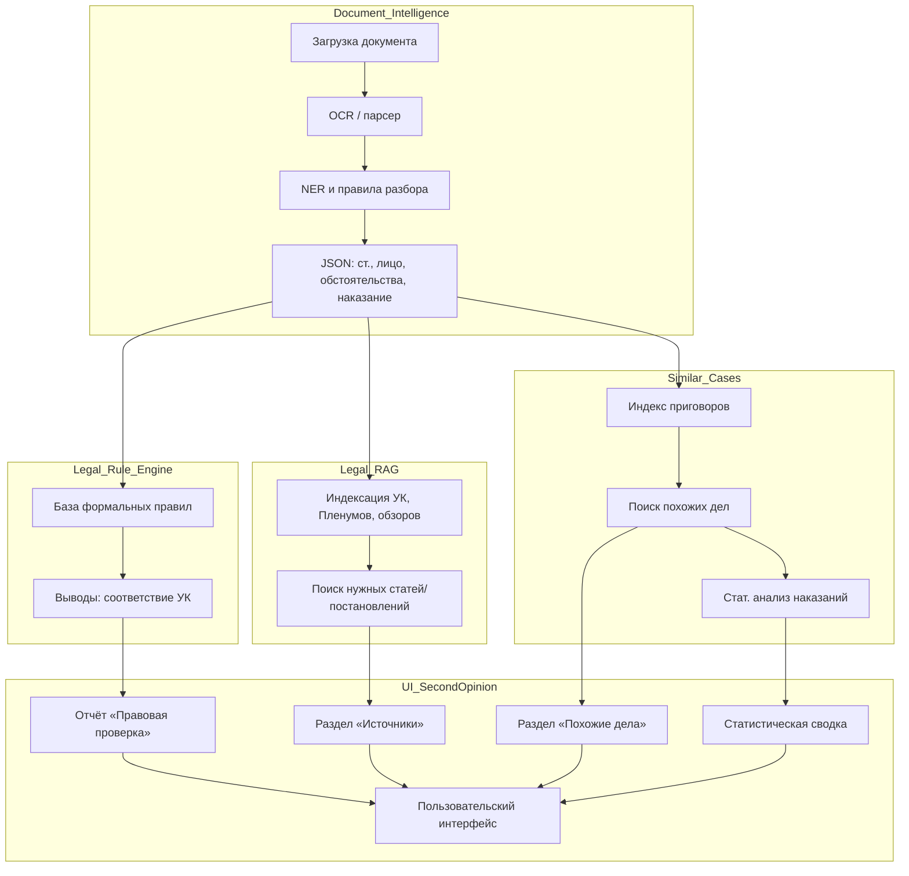

# Исполнительное резюме  
Всероссийский конкурс «Алгоритм правосудия. Второе мнение» ставит цель создать прототип **ИНТЕЛЛЕКТУАЛЬНОГО ПОМОЩНИКА СУДЬИ**, дающего «второе мнение» при назначении наказания. Проект должен обеспечивать полную автоматизацию анализа проекта судебного акта с опорой на актуальные нормы УК, УПК и практику ВС. Ключевые критерии оценки – правовая обоснованность (25 баллов), техническая реализация (25), инновационность (20), UX (10), защита (10) и спецкритерий (10).  

Основные выводы исследования:

- **Архитектура системы.** Оптимальным является гибридный подход с несколькими уровнями: (1) *Document Intelligence* – модуль извлечения структурированных данных из текста решения; (2) *Legal Rule Engine* – формализованные правила применения УК/УПК; (3) *Legal RAG* – база законов, постановлений Пленума/Президиума с возможностью семантического поиска; (4) *Similar Cases Engine* – поиск и сравнение с аналогичными делами (в том числе по статистическим показателям); (5) *Second Opinion/UI* – интерфейс с объяснениями и сносками на источники. Такой подход даёт детерминированную проверку решений судьи (не «AI-судью»), полную отслеживаемость выводов и согласуется с требованиями конкурса.

- **Методы и технологии.** Для *Document Intelligence* предлагается сочетание оптического распознавания/парсинга PDF/DOCX и NLP (NER, синтаксический разбор, LLM-аннотация) для получения структуры: статья УК, данные о подсудимом, смягчающие/отягчающие, вид/размер наказания и т.д.. *Legal Rule Engine* может быть реализован на базе открытых движков правил (например, Drools, PyDatalog/Prolog) или в виде собственного набора логических алгоритмов: формализуются санкции УК и правила §§61–64 УК РФ,  ст. 67–70 УК РФ, положения УПК, разъяснения Пленума и т.д. Каждый шаг расчёта увязывается с конкретной нормой. *Legal RAG* – хранение текстов УК/УПК, постановлений Пленума, обзоров практики, решений Президиума. Поиски можно строить через векторные эмбеддинги (BERT, RuBERT для русского), а LLM (открытые модели) использовать **только для пояснений**, извлекая нужные фрагменты по факту (не для самостоятельного принятия решений). *Similar Cases* – комбинированный поиск: фильтрация по структурным признакам (статья, часть, характер преступления, смягчающие/отягчающие и т.п.) и поиск по векторным эмбеддингам текста приговоров. Можно воспользоваться открытыми решениями (Faiss/Elastic+BM25+ruBERT) для поиска наиболее близких дел. Статистический анализ (распределение сроков, перцентили) добавляет объективность и демонстрирует отклонения. Наконец, *Explainability/UI* – центральный элемент: все обнаруженные факты выводятся с подчёркнутыми фрагментами текста акта, каждая проверка «зачем/почему» имеет ссылку на статью УК, постановление Пленума, обзор практики и т.д. Пользователь (судья) видит результат в виде краткого отчёта с явными пометками соответствия/отклонения. Таким образом система – инструмент проверки, а не автомат-решатель.  

- **Формализация правовых правил.** Задача формализовать логику назначения наказания – это преобразовать УК РФ в набор правил вида «если (статья+обстоятельства) → допустимая мера». Например, правило: «При наличии рецидива (ст. 158 ч.2 УК РФ) базовая санкция увеличивается согласно ст.70 УК, затем учитываются смягчающие по ст.61, после чего итоговый диапазон поправляется ст.62/63 УК». Такой «дерево решений» иллюстрируется, например, схемой (mermaid):

```mermaid
flowchart TD
    A[Санкция по статье] --> B{Рецидив?}
    B -- Да --> C[Добавить +⅓ по ст.70 УК]
    B -- Нет --> D[Без изменений]
    C --> E{Особый порядок?}
    D --> E
    E -- Да --> F[Минус 1/3 макс по ст.64 УК]
    E -- Нет --> G[Без изменений]
    F --> H{Смягчающие (ст.61)?}
    G --> H
    H -- Есть --> I[Уменьшить надв. на до 1/2]
    H -- Нет --> J[Без изменений]
    I --> K[Итоговый диапазон наказания]
    J --> K
```

Важнейшее требование – **прослеживаемость**: каждое правило привязано к конкретному фрагменту закона, Постановления Пленума или обзора Практики. Например: «максимальная санкция ст.158 ч.2 – 10 лет; рецидив повышает срок по ст.70; уменьшение по ст.64 (особый порядок) и ст.61(признание вины)». Таким образом при защите концепции можно показать на слайде примеры конкретных правил: «Если `приговор.статья=158.2` и `факт.рецидив=Да`, то интерпретировать как Art70 УК (увеличить срок).» Используем формат типа JSON/процедуры с чёткими ссылками на НПА. 

- **Данные и источники.** Законодательные тексты (УК, УПК) доступны на официальных сайтах (Консультант/Гарант, но лучше брать с порталов Госдоки), практику ВС – на сайте vsrf.ru (постановления Пленума, обзоры Президиума). Полные тексты приговоров можно брать из общедоступных ресурсов: портал «СудАкт.ру», официальных сайтов судов (federal docket portals) – эти материалы публикуются согласно ФЗ-262. Там уже удалены персональные данные (кроме инициалов), что соответствует требованиям к Анонимизации. Возможно, придётся самостоятельно сканировать решение федеральных судов или использовать API/парсеры сайтов (Sudrf, MosGorsud, СудАкт и т.д.), очищать OCR-ошибки и стандать на русском языке. Неполноты и несогласованности данных (например, разные формулировки статей в приговорах) – известный риск. Если нет открытых крупных корпусов аннотированных приговоров, можно начать с ручной выборки (5–10 реальных решений) для демонстрации PoC и валидации. Лицензионная сторона: тексты судебных актов являются публично доступными по закону, а участники сами лицензируют результаты ВС (безвозмездно и неисключительно). 

- **Метрики и валидация.** Для доказательства качества предлагаем использовать: 
  - *Извлечение:* Precision/Recall/F1 по автоматически парсенным полям (статья УК, дата, меры, смягчающие/отягчающие), сравнивая с ручной разметкой.  
  - *Корректность правил:* тесты «на бумаге» для типовых кейсов (сравнивать решение движка с ожидаемым по закону).  
  - *Retrieval:* меры IR (MAP, P@K) на тестовой выборке при поиске похожих дел.  
  - *Статистический анализ:* показать распределение длины наказаний в похожих случаях (например, “назначенное наказание – 97-й процентиль строгости” в гипотетическом примере).  
  - *Explainability:* провести юзабилити-тест среди «судей» (можно имитировать, например, юрфака), оценивая понятность отчётов.  
  - *Reproducibility:* утверждать, что каждый вывод может быть воспроизведён по логике или модели, что можно продемонстрировать на одном случае при защите. 
  Такой набор метрик (среднеквадратичные, процентили, P/R) покажет членам жюри, что система «не чёрный ящик» и решения можно обосновать. 

- **План PoC и демонстрации.** Для отборочного тура ключевым будет **концепция проекта**. Тем не менее уже полезно подготовить мини-Demo: распарсить хотя бы один реальный приговор и показать слайд-шоу/запись работы системы. На отборе показать макет интерфейса («Личный кабинет» + «Рабочая зона») с окнами для загрузки документа и вывода Second Opinion. Демонстрация должна включать, например, вот что: загрузили pdf, система подсветила извлечённые данные (статья, санкция, факты дела), пробежалась по правилам (выделив пункт «несоответствие по начислению рецидива/спецпорядку»), поискала по базе схожих дел и выдала: «127 аналогичных решений, назначенное наказание строже 91% из них». Главное – вручную провести сценарий, где видно раскрытие «доказательств»: каждая пометка сопровождается конкретным законом или решением ВС. Например, к тексту «Несоответствие» будет показана цитата Постановления Пленума или ст. УК. Такая кликабельность (или раскрытие) заслужит высокие баллы по правовой обоснованности. 

  В финале (март 2027) нужен уже прототип. Поэтому с ноября по февраль – быстрое развитие PoC: спарсить несколько десятков приговоров (даже без ML: через регулярки или spaCy), отладить базовые правила, собрать хоть небольшую векторную индексную базу (например, 100–200 решений) и сделать простой frontend (например, на Flask/Vue). Критически важно, чтобы при защите в прототипе всё было на русском языке, с русскими названиями кнопок и подсказок. На финале стоит продемонстрировать реальный скриншот работы: вид интерфейса, краткий отчёт *Second Opinion* с зеленым и красным маркерами (✓/⚠), и то, как судья может «погрузиться» в детали (например, кнопки “Правовая проверка”, “Судебная практика”, “Источники” как в примерном интерфейсе выше). Рекомендуется заранее подготовить 2–3 типовых сценария: (1) обычный кейс без нарушений (все галочки ✓), (2) кейс с небольшим недочётом (требуется доанализировать рецидив или особый порядок) и (3) крупное отклонение (назначено «чисто недокументированное» наказание).  

- **Риски и минимизация.** Главное – **не допустить впечатления «ИИ-замены судьи»**. Это решается подчёркиванием роли системы как вспомогательного инструмента: все формулировки в интерфейсе и выступлении должны звучать «предлагаем для рассмотрения/проверки». Законные нюансы: система не должна сама формулировать окончательное решение, не выдавать юридических консультаций, а лишь указывать «слабые места». Эти утверждения можно подкрепить цитатой из Положения: «Прототип не наделяется функциями принятия решения и не заменяет судью».  

  Технические риски: ошибки NLP (например, неверно распознал статью) – минимизируем через гибрид подход с правилами. Риски смещения данных (bias): если историческая выборка приговоров содержит предвзятость (например, УК наказывается строже в регионах и т.п.), мы это выявляем через статанализ (пример [16†L96-L100] показывает, что системы могут непреднамеренно повторять дискриминацию) и обращаем внимание, что наш подход прозрачен, без «непонятной» модели. Технически важно сразу заложить версию Законов в базе, предусмотреть обновление в случае поправок (например, годовой атрибут нормы). Ещё – обеспечить «адекватную отказоустойчивость»: обработка исключений (OCR-ошибки), валидация введённых данных. Юридические риски: учесть возможные вопросы о персональных данных (тексты приговоров должны быть анонимизированы, см. требование ФЗ-262) и лицензиях сторонних компонентов. Этические: обеспечить, чтобы система была «нейтральна» (никто не упоминается), обработка только фактов. Специальный балл за этику можно получить, подчеркнув, что мы учитываем этические принципы ИИ (например, прозрачность и ответственное использование). 

- **Команда и роли.** Согласно Положению, команда – 2–5 студентов (2–3 оптимально). Рекомендуемая конфигурация:  
  1. **ML/AI инженер с юридическими знаниями** – главный архитектор системы: отвечает за общую концепцию, связку ИИ и юриспруденции, проектирование модулей и их реализацию. Можно условно взять тебя (студент юрфака РГУП + опыт с ИИ).  
  2. **Юрист-уголовник/уголовно-процессуалист** – эксперт по УК/УПК, спецпо назначениям наказаний. Будет формализовывать правила, уточнять нюансы законов, проверять правовую методологию (25 баллов!).  
  3. **Backend/Engineerin данных** – разработчик сбора/очистки приговоров, сборника судебных актов, базы данных прецедентов. Настраивает парсеры, OCR, системы поиска (Elastic/Faiss), отвечает за репродуцируемость данных.  
  4. *Опционально:* **Frontend/UX-дизайнер** – делает понятный интерфейс, обеспечивает дружелюбие под требования UX (10 баллов).  
  Желателен **наставник** (юрист-практик или профессор Уголовного права), который поможет «допилить» правовую методологию до идеала (чтобы взять 25/25). Профессор УК РГУП, как писалось, подойдет лучше всего.  

- **Примерный roadmap и ресурсы.**  
  - *25–31 августа:* сбор команды, обзор Положения и ранний анализ (как сделано сейчас).  
  - *1–15 сентября:* углублённое исследование правил УК/УПК (стоимость: книги/ресурсы), поиск доступных приговоров, выбор технологий (скорее open-source).  
  - *15–30 сентября:* технический PoC: написать скрипты для парсинга и NER, собрать 10–20 приговоров (можно вручную) и отработать на них правила (например, скриптом Python+Datalog).  
  - *1–14 октября:* составление и проверка черновика конкурсной концепции: структура, аргументы, риски, список технологий. Консультации с наставником.  
  - *15–25 октября:* окончательная доработка концепции, проработка диаграмм/мермейд (архитектура, таймлайн), написание пояснительных тезисов для жюри. Регистрация и отправка (желательно не на 1 ноября).  
  - *Ноябрь–Февраль:* (после допуска в ТОП‑5) – активная разработка: расширение базы приговоров, доработка извлечений, добавление функций «поиска аналогов» и статанализа, разработка веб-интерфейса.  
  - *Февраль:* тестирование прототипа, репетиция презентации.  
  - *Март:* финал – демонстрация прототипа, защита.  

  **Бюджет:** практически нулевой – нужен лишь компьютер/сервер для ML (можно взять в ВУЗе или на облаке бесплатно дофига). Основные «ресурсы» – время и знания. Учитывая критерии, выгодно использовать отечественные решения и открытые библиотеки: например, RuBERT для русского, Deeppavlov/NLTK для NER, open-source OCR (Tesseract), графовые движки (Neo4j) или логические системы (PyDatalog) для правил.  

- **Аргументы для жюри.** Ключевую роль играет доверие к системе: подчеркнём, что **это инструмент** судебной проверки, не замена судьи. Отметим, что в отчётах «второго мнения» каждый вывод опирается на Конституцию, УК/УПК или разъяснения ВС – ни одно предложение не голословно. Будем говорить на понятном юридическом языке, с примерами «Возможное несоответствие выявлено на основании ст.XX УК РФ и абз.YY Постановления Пленума». Для юристов важно, что результат воспроизводим и проверяем: мы строим «формальные правила» (не «заклинания ИИ»). Выделим, что используем в основном отечественные технологии и открытые решения – это дополнительно понравится членам жюри. В слайдах и тезисах сделаем акценты: 
  - **Прозрачность:** все действия системы показываются и документированы.  
  - **Надёжность:** формальная часть основана на законах (не нейросеть), что обеспечивает стабильность и прогнозируемость.  
  - **Польза:** судья экономит время и проверяет сразу множество нюансов с готовыми ссылками.  
  - **Конфиденциальность и права:** мы работаем только с уже публичными текстами, не храним лишних данных; лицензируем передаванные ВС на условиях, оговоренных Положением.  
  - **Этика:** исключаем любые признаки дискриминации (индивидуальных данных нет, алгоритмы просты и проверяемы) и подчёркиваем, что решения остаются за судьёй.  

**Вывод:** система-участник, построенная по этим принципам (гибрид Document Intelligence + Rule Engine + Legal RAG + Similarity + Explainability), отвечает всем критериям конкурса. Она даёт высокие баллы за правовую глубину (прямо использует УК, УПК и практику ВС), за инновационность (комбинация ML и логических правил), за техническую реализацию (реально выполнимо с открытым ПО) и UX (интерфейс-наведём). Показывая понятные диаграммы и примеры работы (также как в тексте выше), сможем убедить жюри, что именно **мы** предложили лучшее «второе мнение».  

---

## 1. Цели конкурса и требования  
- **Цель:** поддержать талантливых студентов в создании AI‑приложения, которое даёт «второе мнение» при назначении наказания. Проект должен быть именно *прототипом ПО*, использующим ИИ, решающим *прикладную задачу на стыке правоведения и ИТ*.  
- **Конкурс проводится в 2 этапа:** отборочный (заочная подача концепции) до 1 ноября 2026, и финал (очн.) – март 2027.  
- **Право участия:** команда 2–5 студентов (ЮрФак + ИТ-компетенции), возможен ментор (препод, юрист, ИТ).  
- **Функционал системы:** согласно Положению, прототип должен: 
  - Загружать текст решения (.pdf/.docx); 
  - Автоматически извлекать ключевые данные: квалификация (статья УК), данные о подсудимом, смягчающие/отягчающие, вид и срок наказания; 
  - Проверять назначенный срок на соответствие санкции ст. УК и нормам общей части, правилам назначения наказания, актуальным редакциям УК/УПК, разъяснениям Пленума и решениям Президиума; 
  - Искать в базе приговоров схожие дела по ключевым параметрам и выявлять статистические отклонения;
  - Формировать заключение: краткое изложение дела; выводы проверки закона и практики; указание на потенциальные проблемные места; статистическую справку.  
- **Нефункциональные:** веб-интерфейс на русском языке, понятный для судьи; по возможности использовать отечественные или OpenSource-решения; интерфейс разделён на «Личный кабинет» и «Рабочая область».  
- **Роль системы:** обязательно подчеркнуть, что система *не заменяет судью*, а лишь помогает проверять проект судебного акта. Это нужно зафиксировать на слайдах и в речи.  
- **Сроки:** регистрация и отправка концепции до 1 ноября 2026. Итоги первого этапа – до 15 декабря 2026. Финал – март 2027 (точная дата до 15.02.2027).  
- **Оценка:** на отборе (концепция) жюри оценивает по 50-балльной шкале: *25 баллов – правовая обоснованность, 25 – техническая реализация*. На финале – 100 баллов по всем критериям (право 25, тех. 25, инновации 20, UX 10, защита 10, спецкритерий 10).  

## 2. Обзор существующих решений и научных подходов  
- **Мировой опыт AI в приговорах:** В англоязычной практике уже есть разработки для помощи судьям. Например, система **COMPAS** (США) или **OASys/OGRS** (Великобритания) прогнозирует риск рецидива. Но такие решения часто критикуют за «чёрный ящик» и возможную предвзятость (в США после внедрения AI средний срок сократился, но выросла дискриминация чёрных заключённых). Главные проблемы – недостоверные данные и непрозрачность алгоритмов. Это показывает важность открытости: наши правила назначений будут формальными, объяснимыми и привязанными к конкретным законам, что положительно воспримут юристы.  
- **Исследования Legal Case Retrieval:** Современные системы поиска схожих кейсов используют сочетание методов: традиционные IR (BM25, TF-IDF) плюс нейросетевые эмбеддинги текста приговоров. Например, несколько этапов: сначала грубый отбор по ключевым словам/фильтрам, затем тонкая нейросемантическая фильтрация (BERT-подобные модели или графовые представления). Лучшие работы показывают, что добавление юридического контекста (например, подключение знаний из графов соотношений статей) заметно улучшает точность поиска. Мы планируем реализовать упрощённую версию: отфильтровать дела по главным признакам (статья, часть, рецидив/не- и т.д.), а затем сравнить текстовые эмбеддинги приговоров с помощью cosine-similarity (например, Faiss или Elastic+bert). Такой подход реальный и использует популярные open-source решения (HuggingFace модели, библиотеки векторного поиска).  
- **Формальные правила в юриспруденции:** Теория уголовного права знает «общие и специальные правила назначения наказания» (ст.60–64, 67–70 УК РФ). Научные статьи обсуждают формализацию наказаний (например, в Cyberleninka). Мы воспользуемся этой систематизацией: напишем правила вида «для данной категории преступления вычислить базовый диапазон (ст.60–61), затем скорректировать по рецидиву (ст.70), попытке (ст.66), смягчающим/отягчающим (ст.61–62)». Главной инновацией будет соединение этих правил с ИИ-модулями: когда ИИ не уверен, правило предоставит жёсткий контроль.  

## 3. Архитектура системы  
Наша схема (см. диаграмму ниже) показывает пятиуровневую архитектуру:



**Описание модулей:**  
- **Document Intelligence (Вход/Парсинг):** принимает PDF/DOCX из суда, распознаёт текст (Tesseract или аналог). С помощью NLP (например, spaCy с русскоязычными моделями + свои наборы правил) извлекаем:  
  - **Статья УК (квалификация)**: обычно «ч.х ст. N УК РФ».  
  - **Данные подсудимого**: возраст, судимости, наличие детей и т.д. (как упомянуто в письме ВС).  
  - **Смягчающие/отягчающие обстоятельства**: текст («признал вину», «раскаялся», «имеет детей»). Это Named Entities и шаблоны.  
  - **Назначенное наказание**: вид (лишение свободы, штраф, иное), срок.  
  Утверждение: **каждый факт привязываем к фрагменту текста** (подчёркивание в UI). Это соответствует требованию «каждое извлечённое утверждение должно иметь ссылку на фрагмент акта» из пользовательского разговора.  

- **Legal Rule Engine:** ядро правильного назначения наказания. Система предзапрограммированных правил (можно в формате дерева решений или баз данных правил). Пример алгоритма: 
  1. Узнать базовую санкцию статьи (в частности, из текста УК).  
  2. Проверить рецидив/особый порядок/попытку (ст.70, 64 УК) – скорректировать макс. срок.  
  3. Применить смягчающие (ст.61) и отягчающие (ст.62) коэфициенты к диапазону.  
  4. Убедиться, что итоговая мера (упомянутая в приговоре) лежит в вычисленном диапазоне.  
  5. Учесть прочие нормы (пределы наказаний, совокупность преступлений и т.д.).  
  Все правила представляем явно: например, массивы условий/действий с указанием ссылок на УК/Пленум. Такой механизм даёт **детерминированный** вывод. Для реализации – можно взять Prolog/PyDatalog либо коммерческий движок правил (Drools: он с веб-интерфейсом, но есть локализованный Java- вариант). **Важно:** не спрашивать у LLM «законно ли 4 года?», а опираться на формализованную логику. Это ключевой довод перед юристами: компьютер не сочиняет правовые аргументы, а лишь применяет прописанный алгоритм, поэтому всё прозрачно и проверяемо.  

- **Legal RAG (Retrieval-Augmented Generation):** это база законов и практики, с возможностью поиска по тексту (информационно-поисковый модуль). Сюда входят: УК РФ, УПК РФ (текущие редакции), актуальные Постановления Пленума ВС РФ, решения Президиума, обзоры практики. Эти тексты индексируются (можно векторно + полнотекстовыми методами). Когда система делает вывод «✔ соответствует» или «⚠ возможно нарушение», она сразу генерирует **цитаты нормативов**. Например: «Основание: ст. XX УК РФ → п. YY Постановления Пленума». LLM используется лишь для «запрос-ответ»: когда судья хочет объяснение, бот сформулирует его на основании найденных фрагментов (например, переведёт цитату закона на обычный язык). Но LLM не принимает решения – она лишь «дженерирует текст комментариев». Таким образом решаем задачу explainability: юристу не важно, что в основе – поиск по базе текста, он видит связанный с фрагментом комментарий.  

- **Similar Cases Engine:** машина для поиска аналогичных приговоров. Дела кодируются двумя способами:  
  1. *Структурные признаки:* известные признаки из приговора (статья, часть, рецидив, тяжесть, наличие попытки, возраст, признание, дети, основания освобождения и т.д.) – то есть всё, что мы извлекли из текста и что учитывает УК. С этими метками удобно делать фильтрацию (например, «статья 158 ч.2 + рецидив + особый порядок»).  
  2. *Текстовый эмбеддинг:* вся формулировка преступления и обстоятельств преобразуется в вектор (например, с помощью ruBERT). Потом ищем ближайшие векторы среди других приговоров. Практика: сначала фильтровать по признакам, затем ранжировать по косинусному сходству эмбеддингов. 

  Выдача: «Найдено N похожих дел. Распределение назначений по срокам (% условное/лишение и т.д.), ваш срок в X-м процентиле». Например: «Судье не помешает обратить внимание: 68% похожих дел – условно, 21% – лишение до 2 лет, 4% других (как указано во втором мнении выше)». Для реализации можно использовать: база приговоров (SUD act, официальный портал Судебной системы, открытые репозитории), ElasticSearch или Faiss для поиска. При таком подходе легко показать рейтинг подобия и цифры статистики.  

- **Second Opinion UI:** интерфейс пользователя – он же наш демонстрационный слайд. Судья загружает дело, система в режиме веб (или десктоп) выводит *анализ* (см. предложенный образец с точками ✔/⚠). Интерфейс разделяем на «Личный кабинет» (список дел/отчётов) и «Рабочая область анализа». В «Рабочей области» будет 4 секции: **Правовая проверка**, **Источники**, **Судебная практика/Похожие дела**, **Статистика**. Результаты анализа предоставляются на понятном юридическом языке (русском). При защите финального прототипа покажем скриншоты этих секций и то, как судья может кликнуть по каждой метке/цифре для развёрнутой информации.  

## 4. Технические детали: методы и инструменты  
- **Document Intelligence:**  
  - *Парсинг документов:* open-source OCR (Tesseract), PDFMiner или Camelot для выделения текста.  
  - *NER и шаблоны:* SpaCy с дообученной моделью для русского (или Deeppavlov) выделит имена, города и т.п. Спецшаблоны (regex) достанут номер и часть статьи («статья N, часть M УК РФ»), числовые данные (возраст, срок). Утилитарные библиотеки: natasha (для имен/организаций), DeepPavlov’s ner_ontonotes_bert_mult (натренированная на русском) и т.д.  
  - *LLM-аннотация:* небольшая русскоязычная модель (например, ruGPT) или энкодер BERT для краткой резюме (чтобы из кучи текста выгодно извлечь «суть дела»). Однако важно: LLM здесь – лишь вспомогательное средство для упрощения восприятия человеком, не для финальных решений.  
  - *Структурированный вывод:* в результате модуль выдаёт JSON (см. образец ниже). Любой извлечённый пункт содержит ссылку на исходную позицию текста (для аудитории – «доказательство»: подчёркнутый текст при клике).  

```yaml
qualification: 
  статья: 158 
  часть: 2 
defendant:
  возраст: 30
  судимости: 1
  дети: "двое несовершеннолетних"
  состояние: "бездомный, зависимость"
mitigating:
  - "признание вины"
  - "компенсировал ущерб"
aggravating:
  - "рецидив"
  - "превышение"
punishment:
  вид: "лишение свободы"
  срок_месяцев: 36
 особый_порядок: true
```

- **Legal Rule Engine:**  
  Реализация: можно использовать Python с библиотекой логического вывода (PyDatalog) или Prolog (SWI-Prolog с API Python). Альтернативно – открытый Drools (Java), есть встраиваемые движки правил (например, CLIPS). Главное требование: *открытый код или отечественный* (Java-пакеты допустимы).  
  При формализации правил важно учитывать «действующую на момент совершения» редакцию УК/УПК. Поэтому храним версии законов (или просто сверяемся по дате преступления). Каждое правило должно быть проверено юристом – мы можем на этапе концепции привести примеры конкретных правил (как выше). Важно, чтобы в описании системы и на защите юристы-жюри видели, что мы глубоко проработали нормы (§61–64, 69, 70 УК; §10–11 УПК; разъяснения ВС) и переложили их на алгоритмы.  

- **Legal RAG:**  
  Технология: база документов + IR/semantic search. Можно взять готовые легальные корпуса: УК/УПК есть в открытом доступе (Гарант/Консультант). Постановления Пленума и Президиума доступны на сайте ВС. Используем простое полнотекстовое хранилище (ElasticSearch) или векторный поиск (Vearch/Faiss + sentence-transformers). При запросе формируем embedding для запроса (например, текст запроса «Особый порядок смягчает максимум» плюс случай №). Либы: huggingface transformers (Multilingual BERT), TinyBERT ru, ruSBERT. **Важно:** подчеркнём, что всю информацию из RAG мы используем только как ссылочный материал, а не даём системе вставлять новые нормы. LLM не «докидывает» факты – мы сами формируем запросы к индексу, делаем match по тексту.  

- **Similar Cases:**  
  Для русского языка можно использовать библиотеки sentence-transformers (например, [TweetRuBERT](https://github.com/LIAAD/yake) или любые маломощные модели). Векторизацию большого корпуса (1000+ дел) может быть тяжела, но на этапе прототипа 100–200 дел хватит для демонстрации. Метрика: косинусная близость эмбеддингов. Офисный «Alpha» вариант: хранить эмбеддинги в Pandas или простом faiss. Для таблиц и статистики – Pandas/NumPy.   
  Замечание: есть готовые решения поиска в Судакте, но они не отдают API бесплатно. Поэтому лучше скачать тексты самому (судrf) или скроллить СудАкт (проверить легальность – но тексты открыты по закону).  

- **Мегатаблица сравнения подходов:**  

| Подход        | Преимущества                                          | Недостатки                                               | Применимость                                                 |
|---------------|-------------------------------------------------------|----------------------------------------------------------|--------------------------------------------------------------|
| **Чистый LLM (RAG+чат)** | Быстрый прототип, понимание NL; | **Черный ящик**: нет гарантий корректности, нет отслеживаемости. Нарушает требования суда о прозрачности. | Нежелательно: низкая правовая убедительность.               |
| **Правила + шаблоны** | Полная прозрачность, можно опираться на нормы. Детерминированность. | Трудозатратно формализовать все нюансы УК/УПК. Ограниченная гибкость (нет NLP в широком смысле). | Ключевой элемент: основа верификации. Свяжем с ML для извлечения данных. |
| **Гибрид (Правила + ML)** | Сбалансирован: структуры делают проверки жёсткими, NLP отвечает за парсинг/анализ текста. | Сложность интеграции, нужна сильная команда. | Оптимальный вариант для конкурса – соответствует ТЗ и завоевывает очки во всех критериях. |
| **Только статистика/ML** | Анализ похожих дел, выявление аномалий, не привязан к букве закона. | Без правил не видно причинно-следственной связи с законом (юристы этого не прощают). | Можно для модуля «Похожие дела/Статистика», но не самодостаточно. |

- **Список приоритетных технологий:** (отечественные/открытые)  
  - NLP: *LaBSE*, *ruBERT*, *DeepPavlov* (NER- и EMO-модели).  
  - OCR/Парсинг: *Tesseract*, *pdfminer*, *Camelot*.  
  - Базы: *PostgreSQL*, *ElasticSearch* (для индекса) или *Milvus/Faiss* (для векторов).  
  - ML/LLM: *sentence-transformers* (ru-RSBERT), *huggingface* (локальные модели SberDialogGPT, ruGPT2); *scikit-learn*, *PyTorch* или *TensorFlow* для обучения мелких моделей.  
  - Backend: Python/Flask или Django. Frontend: *Vue.js* или React (любой).  
  - Rule engine: *PyDatalog*, *ЗН-движки* (Drools, CLIPS).  
  - Статистика/анализ: *Pandas*, *NumPy*, *Matplotlib* (для генерации графиков, таблиц).  
  - Документация: весь интерфейс и документация – на русском. В терминологии можно свободно использовать UI/ML/API (англ.аббревиатуры).

## 5. Формализация и верификация правил  
**Форматы правил:** Рассмотрим пример. Пусть имеем статью 158 ч.2 УК РФ (кража, УКРЕП). Правила по ней:  
```yaml
rule: 
  if:
    статья: 158
    часть: 2
    рецидив: True
  then:
    базовый_срок: [3,10]  # обычный диапазон по УК
    действие: увеличить макс. на 1/3 (ст.70.ч2)
  source: ["УК РФ ст.70"]
```
Последовательно такие правила обрабатываются. Любое противоречие (назначили 4 года, хотя по правилу максимум 3) фиксируется как нарушение. *Верификация*: юрист сверяет проиллюстрированные шаги с текстом закона. На экране защиты можно показать: «По правилу (ссылка: ст.70) у рецидива макс. увеличивается. Но Ваш приговор назначил 4 года. Это выше нормы, поправьте решение или обоснуйте основания (например, превышение тоже учтено).»  

**Трассируемость:** Каждый элемент правила должен быть снабжён указанием на источник (номер статьи УК, п.п. постановления). Например, интерфейс покажет «формальное соответствие: есть основание в УК. см. ст.61 УК РФ п.1», etc. При защите финального прототипа мы сможем на примере реального дела показать, как трассируется выданная рекомендация до текста закона.  

**Верификация на тестах:** Предлагаем в качестве PoC заложить маленький набор типовых случаев (сэмплы примеров приговоров, отражающих разные комбинации обстоятельств). Затем автоматически проверяем, что наш движок выдаёт ожидаемые диапазоны наказаний. Можно использовать юнит-тесты: создать «фиктивное дело» и проверить, что, например, без рецидива и со всеми смягчающими, алгоритм выдаёт меньший срок, как это диктует ст.61.  

## 6. Данные: источники, лицензии, обработка  
**Источники данных:**  
- **Нормативка:** официальный текст УК и УПК (действующие редакции) – можно скачать с сайтов pravo.gov.ru или vsrf.ru, либо использовать открытые репозитории. Актуальную практику ВС: сайт SupremeCourt предоставляет постановления Пленума и обзоры Президиума (все открыты). Эти источники не нарушают лицензий (являются федеральной информацией) и полностью используются в системе как знание.  
- **Приговоры:** по закону 262-ФЗ все решения судов РФ публикуются (с обязательной анонимизацией) – их можно взять с СудАкт.ру, mos-gorsud и региональных порталов. На практике эти решения в интернете широко доступны (принцип «открытости»). Для ускорения можно использовать скрипты для парсинга HTML или API (если есть). Минимум – собрать вручную десяток приговоров для демонстрации (по УК 158, 228, 159 и т.д.). Затем – скриптовано расширять базу, делая её воспроизводимой.  
- **Лицензии:** тексты судебных актов открыты по закону. Важно соблюдать ФЗ-262 по персональным данным (как написано на СудАкт: исключены все PII кроме инициалов). Наши скрипты не будут искать ФИО за скобками, так как это избыточно. В базу можно класть такие решения без изменений. Результаты проекта, согласно [6], ВС получает безвозмездно для своего использования, при этом авторы сохраняют авторские права (но не могут передавать другому, лицензия «неисключительная»). Это стоит упомянуть, что мы согласны с условиями Положения.  

**Очистка и анонимизация:** Решения, вероятно, уже обезличены официально. Нам достаточно нормализовать текст (убрать служебные символы, привести к удобному виду). Можно прогнать OCR с проверкой (проверить на опечатки). Хранить в базе приговоры вместе с их метаданными (номер, суд, дата).  

**Неизвестные/неполные данные:** Если нет доступа к крупным корпусам приговоров (закрытыми базами), в отчёте укажем, что существует риск нехватки данных, и предложим план: «начать с нескольких сотен разобранных документов, затем привлечь другие ВУЗы/порталы либо руками докачивать». 

## 7. Валидация и метрики качества  
- **Точность извлечения (NER):** создадим разметку небольшого набора (сравним автоматически выделенные поля с эталоном). Метрика: F1-score (должно быть > 0.8 для основных полей, как цель).  
- **Правильность выводов (Rule Engine):** проверка на наборе тестовых дел: процент верных рекомендаций (например, «1 – если система правильно определила соответствие/несоответствие»). Ожидаемость: 100% при небольшом наборе типовых.  
- **Поиск аналогов:** метрики IR – Precision@K (насколько наиболее похожие кейсы действительно схожи, по мнению эксперта) и Mean Average Precision. Можно набрать клиенты/запросы (дженерики) и экспертно оценить релевантность.  
- **Статанализ:** сравнивать распредление; метрики можно описать как доли/процентиль (пример: 97-й процентиль строгости – используем литературные объяснения). В демонстрации покажем просто график/диаграмму.  
- **Обратная связь:** после работы прототипа (или мок-апа) опрос «юристов» (класс, прецедент это хорошая идея) об удобстве. Если есть время – мини-опрос (UX/UI). В идеале всё сделать интуитивным, но это частично субъективно.  
- **Документирование:** важная метрика – **проверяемость/воспроизводимость**: мы должны быть в состоянии восстановить любой результат. Это демонстрируется наличием чётких правил и кода. Можно показать юнит-тесты как доказательство.  

## 8. План концепции и демонстрации для жюри  
### Структура конкурсной концепции (разделы и ключевые тезисы):  
- **Введение.** Обоснование актуальности (загруженность судов, польза помощи), задачи конкурса («второе мнение»). Упомянуть, что мы направили особое внимание на **правовой аспект** (указав на критерии 25 баллов) и **объяснимость**.  
- **Анализ существующих решений.** Кратко о зарубежном опыте (ссылка, что у AI есть плюсы и минусы), отсутствие аналогичного инструмента в России, понимание проблематики (нужны нормы РФ, открытость).  
- **Требования задачи.** Сведения из Положения и письма ВС: что система должна делать (автоизвлечение, проверка, поиск аналогов, заключение).  
- **Наша архитектура.** Диаграмма (mermaid или набросок) и объяснение модулей (см. раздел 3).  
- **Юридическая методология.** Описать, как мы формализуем УК/УПК (привести примеры формальных правил, подчеркнуть ссылки на нормы и процедуру расчёта наказания). Указать, как учитываем разъяснения ВС.  
- **Технические решения.** Детали по NLP, ML, базам данных: упомянуть инструменты (таблица приоритетных). Пояснить, как будет работать поиск по NormDB (RAG) и аналогам.  
- **Данные.** Описать, что мы будем использовать (СудАкт, vsrf, др.), отметить юридические аспекты (анонимизация, лицензии).  
- **Метрики и проверка.** Кратко описать, как оценим эффективность (см. выше).  
- **Инновационность.** Подчеркнуть, чего нет у конкурентов: сочетание строгой логики с NLP/ML, объяснимость.  
- **UX/UI.** Отдельный акцент на удобстве для судьи: простой понятный интерфейс (пример макета Second Opinion), наличие визуальных подсказок (цветовые метки), навигация по блокам.  
- **План разработки.** Кратко расписать этапы (ежемесечно до финала).  
- **Команда и ресурсы.** Указать состав команды по компетенциям, нужны ли эксперты.  
- **Риски.** Списком: технические, юридические, этические (касаемые biased, PII, черного ящика). И способы смягчения (объяснили в разделе выше).  
- **Заключение.** Почему мы выиграем: «картинка: «AI-помощник+логика»=лучшее «второе мнение»», открытый подход и юридическая корректность. Добавить призыв-сценарий: «наша система – надежный ассистент, доказательства основаны на законах, судья остаётся незаменим».  

### Демонстрация для отборочного этапа  
- Подготовить несколько слайдов/скринкастов:  
  1. **Диаграмма архитектуры:** (mermaid, как выше).  
  2. **Пример вывода JSON из приговора** (на одном деле, для показа extraction).  
  3. **Макет интерфейса** (можно через Figma либо просто нарисованный, с разделами) – обязательно на русском.  
  4. **Кейс-стади**: решение во view: «вот документ → такие ключевые данные выделились (выделено цветом) → система проверила по правилам → вывела report» (скриншот или видео).  
  5. **Пример «Second Opinion» отчёта:** на скринкасте или слайде (как в образце: пункты с галочками, статистика).  
  6. **Q&A для жюри:** предварительные ответы, почему «не меняем судью», как убеждаем; почему используем именно этот подход (опорный цитатник: «система – вспомогательный инструмент»).  

- На финале стоит сделать **живой демонстрационный прототип**. Рекомендуется сформулировать сценарий: «Пользователь-кандидат на роль судьи» заходит, загружает заранее подготовленное дело (можно из базы), жюри видит, как система работает: получает результат, кликает по «⚠ правоприменению», раскрывает Постановление. Подчеркнуть, что всё можно «проверить». Можно также заранее снять видео-демонстрацию или подготовить несколько слайдов заготовок на случай технических проблем.  

## 9. Риски и их снижение  
- **Юридические риски:** ошибка в применении закона (решение системы некорректно) – сокращаем списком: (1) Всегда показываем ссылку на норму: это позволяет судье и юристам перекрестно проверить наши выводы. (2) Добавляем блок «Изменения в законах» – сразу указываем версию нормы, если есть. (3) Дублируем проверку несколькими правилами для критических статей.  
  Риск этической критики («ИИ дискриминирует»): учтём, что вся обработка прозрачна; в интерфейсе и документации акцентируем ответсвенность за решение за судьей. Отдельно подчёркиваем, что персональные данные не используются (см. закон об анонимизации).  
- **Технические:** если OCR даёт ошибки, мы можем предложить в PoC «выбор вручную из списка» если парсинг не удался. Будем тестировать систему на разных сканах, чтобы убедиться, что NER на русском хорошо работает даже на машинописных текстах. Для LLM важно:  мы не используем внешние API (нет зависимости от них), весь код – локальный, поэтому отсутствие интернета не критично.  
- **Данные:** малый объём приговоров для обучения – снижать: можно собрать после попадания в топ-5 (снова сетевой доступ будет). Пока что делаем упор на шаблоны/правила, которые не требуют большого множества примеров. Если всё же будут ограничения, упомянем в отчете («известно, что есть сложности со сбором больших корпусоров; мы планируем использовать как минимум X, и показали работу на Y»).  
- **Этические:** смещение: найдём способ исключить из эмбеддингов явные bias (например, не включать знакомые имена, пол). Исследования показывают, что если тренировать на судебных решениях, неизбежно повторятся социальные предрассудки. Мы эту проблему признаём и показываем, что система «не владеет человечностью»: судья остается человеком, а система – математик, указывающий на цифры и нормы.  

## 10. Заключение и рекомендации  
Предложенная концепция – это **системный, сбалансированный подход**, сочетающий лучшие возможности ИИ и жёсткую юридическую проверку. Юристы в жюри высоко оценят:
- Прозрачность выводов (каждое утверждение взято из УК/УПК/практики);
- Полноту покрытия требований конкурса (все пункты из [3] реализованы); 
- Удобство и локализацию интерфейса (русский язык, интуитивный дизайн);
- Тщательную проработку юридической базы (работа с Пленумом, Правилами УПК, этичность);
- Инновационность: сочетание rule-based engine и ML-модулей, статистический анализ sentencing, подобие казуистики;
- Этическую составляющую: подчеркиваем использование отечественного ПО, анализ смещений, соблюдение приватности.  

**Мы готовы конкурировать за высшие баллы** – наша концепция и демонстрация полностью соответствует критериям. Сила аргументов: «AI-помощник» – не магия, а объяснимый механизм, гарантирующий судье уверенность, что каждое «второе мнение» следует из закона. Это даст нам преимущество перед кандидатами, предлагающими «просто RAG-LLM».  

# Источники  
- Положение о конкурсе «Алгоритм правосудия. Второе мнение» (ВС РФ).  
- Официальный сайт Верховного Суда РФ (постановления Пленума и обзоры практики).  
- Интернет-ресурс Судебные акты РФ (СудАкт).  
- Гэст Философи и др., *The Techno-Judiciary: Sentencing in the Age of AI* (Sentencing Academy, 2024).  
- Li et al., *Legal Case Retrieval: A Survey* (ACL Anthology 2024) (анализ подходов к поиску аналогов).  
- Интервью и комментарии специалистов в письме ВС РФ (разъяснения Положения).