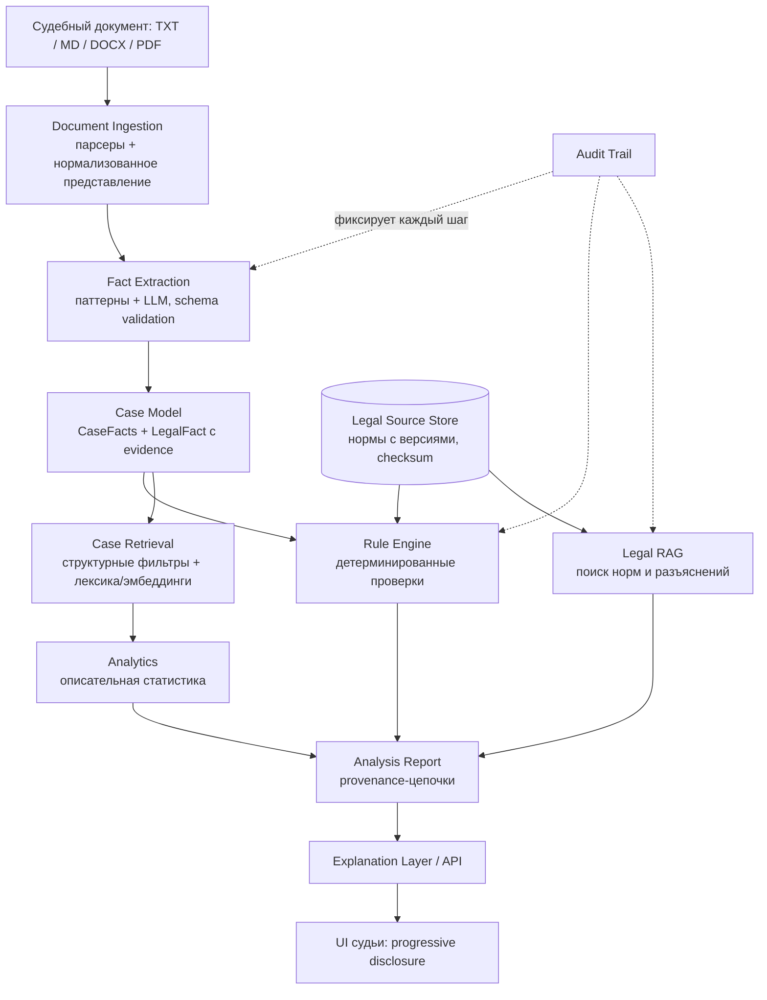

# ARCHITECTURE

Модульный монолит на Python 3.11+. Один процесс, слои разделены интерфейсами;
модули не ходят друг к другу в обход контрактов. Выбор против микросервисов —
см. `QWEN.md` («modular monolith > premature microservices») и ADR-001/ADR-006.

## Конвейер

## Слои

| Слой | Модуль | Ответственность | Запрещено |
|---|---|---|---|
| Представление | `api`, `static` | HTTP DTO, раздача UI | Бизнес-логика в хендлерах |
| Оркестрация | `pipeline.py` | Последовательность этапов анализа | Собственные юридические утверждения |
| Домен | `domain` | Pydantic-модели фактов, норм, оценок | I/O, сеть, файлы |
| Приложение | `fact_extraction`, `rule_engine`, `legal_sources`, `retrieval`, `analytics` | Реализация этапов | Прямые LLM-вызовы вне `llm` |
| Инфраструктура | `storage`, `llm`, `audit` | Репозитории, LLM-провайдеры, журнал | Юридическая семантика |

## Компоненты

### Document ingestion (`ingestion/`)
Парсеры TXT, Markdown, DOCX, PDF (текстовый слой) → нормализованный
`Document`: `Section`/фрагменты с `start_offset`/`end_offset` (и `page` для
PDF). Все последующие ссылки на текст документа идут только через оффсеты.

### Fact extraction (`fact_extraction/`)
Два экстрактора за общим интерфейсом:
- **паттерновый** (детерминированный): квалификации «ч. 2 ст. 158 УК РФ»,
  возраст, смягчающие/отягчающие маркеры, вид/размер наказания, особый
  порядок. Каждый результат несёт evidence с оффсетами совпадения.
- **LLM-экстрактор**: структурированный вывод по схеме (повторная попытка при
  невалидном JSON), валидация Pydantic-схемой.

Результаты объединяются; факт без evidence не может получить статус
`VERIFIED`.

### Legal ontology / Case model (`domain/`)
Разделены: факт (`LegalFact`), обстоятельство, норма (`LegalNorm`), версия
нормы (`NormVersion`), применение (`RuleEvaluation`), вывод, источник,
судебный акт (`ComparableCase`). Подробности — `DOMAIN_MODEL.md`.

### Temporal legal source storage (`legal_sources/`)
`NormStore.get_norm(norm_id, applicable_at)` возвращает редакцию, действовавшую
на дату. Каждая редакция: `effective_from/to`, источник, `retrieved_at`,
SHA-256 контрольная сумма текста. ADR-002.

### Rule engine (`rule_engine/`)
Принимает `CaseFacts` + применимые редакции норм; выдаёт `RuleEvaluation[]`
со статусами `PASS / WARNING / FAIL / UNKNOWN`, списками использованных
фактов и норм, объяснением и provenance. Правила — версионируемые
Python-классы с декларативными метаданными (без самописного DSL). ADR-001.

### Legal RAG (`legal_rag/` — майлстоун M5)
Поиск норм/Пленумов/обзоров: метаданные-фильтры + лексический поиск +
(далее) эмбеддинги и реранкинг. Запрещено выдавать юридическое утверждение
без извлечённого фрагмента-источника. В MVP часть функций закрывает
`NormStore` + фильтр по метаданным.

### Case retrieval (`retrieval/`)
Поиск сопоставимых дел: структурные фильтры (статья, часть, покушение,
рецидив, процедура) → ранжирование. В будущем — гибридный поиск (ADR-003).
Сходство — справочный сигнал, не основание для вывода о наказании.

### Analytics (`analytics/`)
Описательная статистика по выборке: N, медиана/перцентили, распределение
видов наказания, доля условного. Только дескриптивные формулировки.

### Audit trail (`audit/`)
JSONL-журнал: время, операция, компонент, хэши входа/выхода, модель и её
версия, версия промпта, версия правил, версии норм. Позволяет воспроизвести
любой отчёт.

### LLM (`llm/`)
Интерфейс `LLMProvider` (`generate_structured`, `generate_text`, `embed`),
адаптеры: `MockLLMProvider` (тесты/офлайн), `OpenAICompatibleProvider`
(любой OpenAI-совместимый контур). Ключи — только из переменных окружения.
ADR-004.

### Evaluation (`evaluation/`)
Метрики: precision/recall/F1 извлечения + корректность и покрытие evidence;
Recall@K/MRR/nDCG поиска; полнота цитирования; корректность выбора редакции;
регрессия Rule Engine; `unsupported_claim_rate` (целевое → 0).

## Технологический стек MVP

- Python 3.11+, FastAPI, Pydantic v2, uvicorn.
- Хранение: файловые репозитории (за интерфейсами) → целевой стек
  PostgreSQL (+pgvector) в M5/M6. ADR-006.
- Тесты: pytest; линт: ruff; CI: GitHub Actions (lint + tests).

## Развёртывание

Одна команда: `make dev` (или `python -m second_opinion.cli serve`).
Docker Compose появится вместе с PostgreSQL (M5+).
