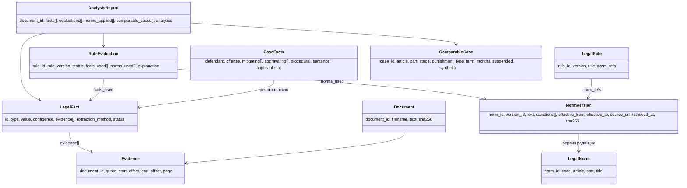

# DOMAIN_MODEL

Доменная модель разделяет: факт, юридическое обстоятельство, норму, версию
нормы, применение нормы (оценку), вывод, источник и судебный акт. Реализация —
Pydantic v2 модели в `src/second_opinion/domain/`.

## Обзор сущностей

## Ключевые сущности

### Document
Нормализованный результат парсинга: `document_id`, `filename`, полный `text`,
SHA-256 текста. Все цитирования ссылаются на `text` оффсетами.

### Evidence
`{document_id, quote, start_offset, end_offset, page?}`.
Инвариант: `text[start_offset:end_offset] == quote` (нормализованные
пробельные различия допускаются только для PDF/DOCX, см. тесты).

### LegalFact
Юридически значимый факт, извлечённый из документа.

| Поле | Описание |
|---|---|
| `id` | устойчивый идентификатор |
| `type` | перечисление `FactType` (см. ниже) |
| `value` | структурированное значение (bool/число/строка/объект) |
| `confidence` | 0..1 |
| `evidence` | список `Evidence`; **пустой список ⇒ факт не может быть `VERIFIED`** |
| `extraction_method` | `pattern` / `llm:<model>` / `user` |
| `status` | `VERIFIED / LIKELY / UNCERTAIN / NOT_FOUND / CONFLICT` |

`FactType` (доменный срез MVP): `qualification`, `defendant_age`,
`prior_convictions`, `minor_dependents`, `health_factor`, `offense_stage`,
`guilty_plea`, `surrender_or_confession`, `restitution`, `aggravating_recidivism`,
`special_procedure`, `jury_trial`, `punishment_type`, `punishment_term`,
`suspended_sentence`.

### CaseFacts
Агрегат обстоятельств дела, собранный из реестра `LegalFact`:
`defendant` (возраст, судимости, несовершеннолетние дети, здоровье),
`offense` (квалификации `{статья, часть}`, стадия, роль),
`mitigating[]`/`aggravating[]` (коды по ст. 61/63 УК с ссылками на факты),
`procedural` (особый порядок, признание, соглашение, суд присяжных),
`sentence` (вид наказания, срок в месяцах, условность),
`applicable_at` (юридически значимая дата для выбора редакции нормы).

### LegalNorm / NormVersion
Норма и её временны́е редакции. `NormVersion` содержит: текст статьи (или
фрагмент), санкции `SanctionSpec[{punishment_type, min_months?, max_months?}]`,
`effective_from`, `effective_to` (null = действует), реквизиты источника,
`retrieved_at`, SHA-256 текста, `verification_status` (`draft|verified`).
Запрос: `NormStore.get_norm(norm_id, applicable_at)` → ровно одна версия
или явная ошибка.

### LegalRule / RuleEvaluation
Правило — версионируемый класс с метаданными (`rule_id`, `version`, `title`,
`norm_refs`) и методом `evaluate(context) -> RuleEvaluation`.

`RuleEvaluation`: статус `PASS | WARNING | FAIL | UNKNOWN`, человекочитаемые
`headline` и `explanation`, `facts_used[]` (id фактов), `norms_used[]`
(норма + `version_id`), численные результаты (`numbers`, например
`term_months` и `limit_months`).

Семантика статусов:
- `PASS` — ограничение соблюдено;
- `WARNING` — обнаружено обстоятельство, требующее внимания судьи;
- `FAIL` — обнаружено возможное нарушение формального ограничения;
- `UNKNOWN` — недостаточно фактов/данных нормы; система не догадывается.

### ComparableCase
Судебный акт в базе практики: структурные признаки (статья, часть, стадия,
рецидив, процедура, смягчающие/отягчающие коды), назначенное наказание
(вид, срок, условность), краткое резюме, флаг `synthetic` (обязателен для
фикстур). Сопоставление сопровождается `reasons[]` — по каким признакам
дело отобрано.

### AnalysisReport
Итог анализа: извлечённые факты, `CaseFacts`, оценки правил, применённые
редакции норм, сопоставимые дела с причинами отбора, описательная
аналитика, дисклеймеры. Всё с provenance.

## Правила вывода статусов фактов

1. `VERIFIED` — есть ≥1 evidence, цитата подтверждена в тексте, значение
   извлечено детерминированно (`pattern`) либо подтверждено пользователем.
2. `LIKELY` — evidence есть, но значение получено недетерминированно (LLM)
   и не подтверждено человеком.
3. `UNCERTAIN` — противоречивые фрагменты либо низкая уверенность.
4. `NOT_FOUND` — обстоятельство в документе не обнаружено (это тоже
   информативный результат).
5. `CONFLICT` — источники/фрагменты противоречат друг другу.
